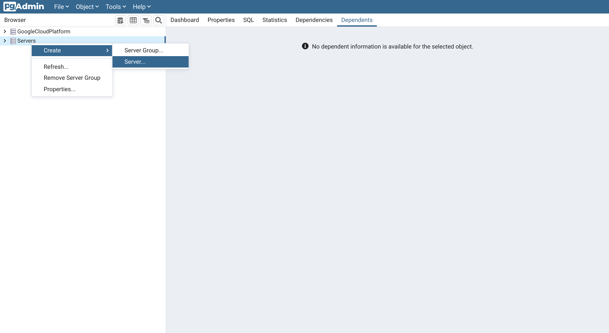
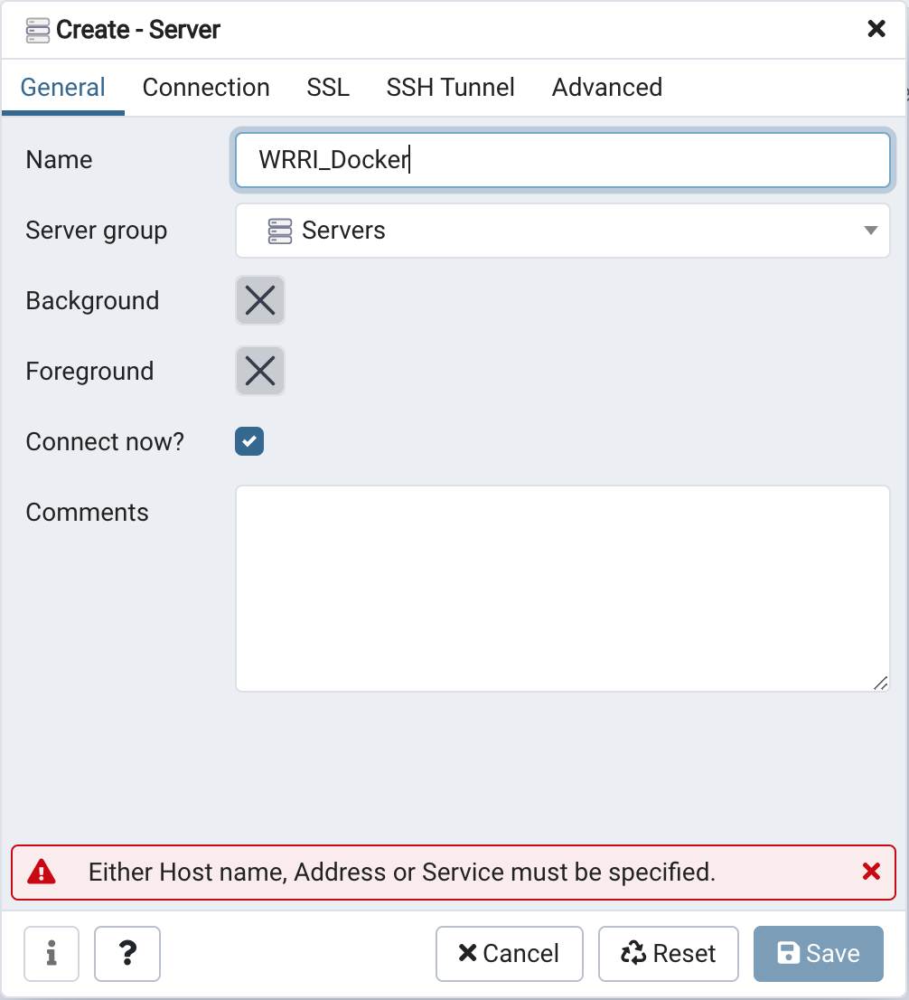
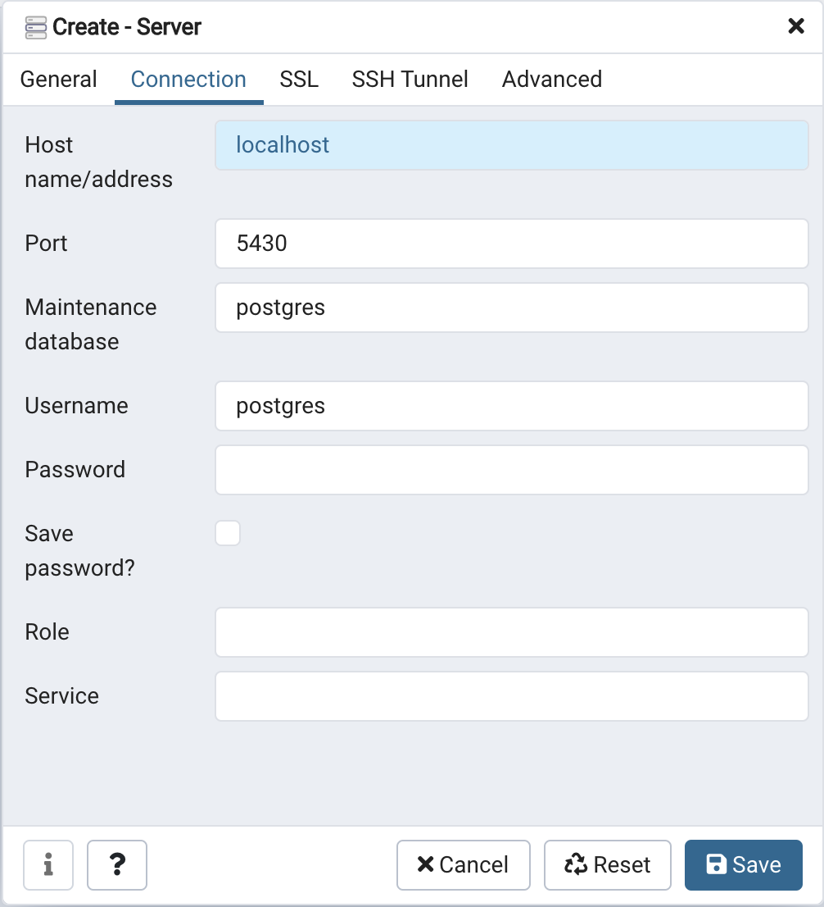

[](https://mybinder.org/v2/gh/cwhite911/nutrient-loading-model/main?urlpath=rstudio)

# nutrient-loading-model
Development Envronment for the HUC12 sub watershed nutrient loading model. 

- R version v3.6.3
- PostgreSQL v12.5
- PostGIS v3.0.2

>Note: Use [PGAdmin4](https://www.pgadmin.org/download/) to interact directly with the Postgres database named `WRRI` running on `localhost:5430` with the user `postgres`

# How to use
Install [docker](https://docs.docker.com/get-docker/) to run RStudio in the browser.

## Download Latest Postgres Backup
Copy `wrri_pg_bak` from Google Drive (WRRI_FallsJordan) into the top level of this git repository

## Build and Run the docker services
```docker
docker-compose up -d
```

## Go to RStudio in the browser
```
http://localhost:8787/
```

## Reload new database backup
```
docker-compose restart -d
```

## How To...
### Add or update a R Library 
Add or remove R Libraries in `install.R` and then rebuild the docker container to see changes.

### Add or update a linux package 
Add or remove linux packages in `apt.txt` then rebuild the docker container to see changes.

### Create New Database Backup
Run the following command from the root directory in the terminal

This command will create a new backup of the database saving any new data or views you added.
```
docker-compose exec postgis  pg_dump -d WRRI -U postgres -w -f /etc/postgresql/wrri_pg_bak -F c -b
```

Now you need to copy the backup back to your machine using the following command.
```
docker cp nutrient-loading-model_postgis_1:/etc/postgresql/wrri_pg_bak .
```

Finally, update the backup in the shared Google Drive to share with others.


### Setup PGAdmin4

1. Install [PGAdmin4](https://www.pgadmin.org/download/) if you do not already have it.

2. Create a new server using by right clicking **Server -> Create -> Server** .


3. In the create server panel's General tab set the server name to `WRRI_Docker`.




4. Select the Connection tab from the create server panel. For the **Host name/address** enter `localhost`, set **Port** to `5430`, set the **Maintenance database** to `postgres`, and set the **username** to `postgres`, leave the password empty.



5. Click `save` at the bottom right of the **Create - Server** panel.

You are now connected to the database and will see your saved connection on the left panel of PGAdmin with the label `WRRI_Docker`.
