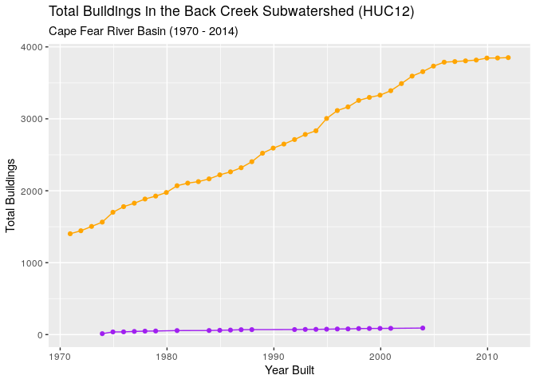
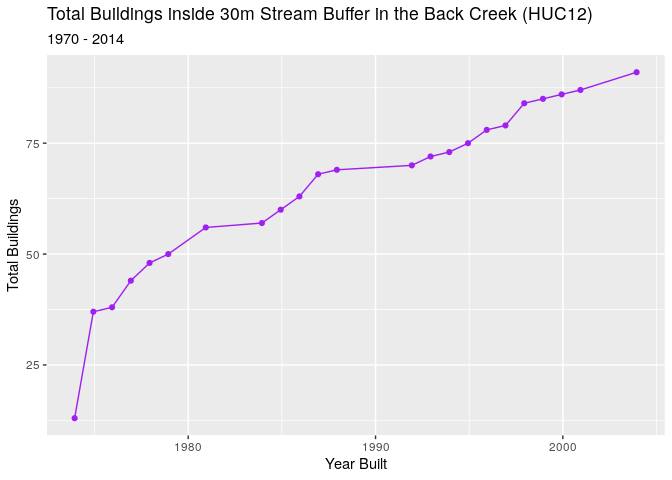
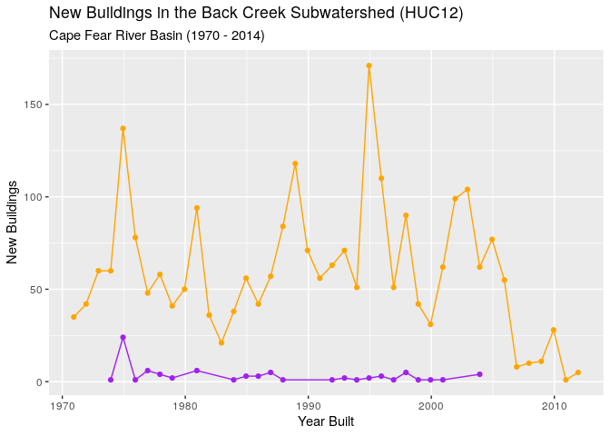
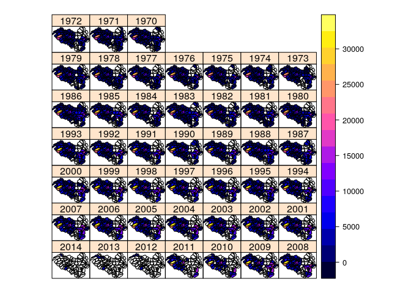
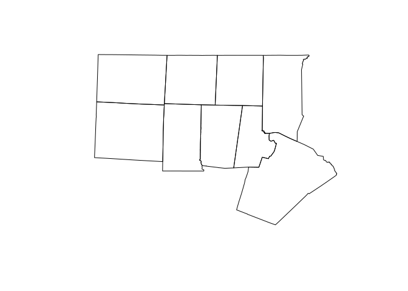
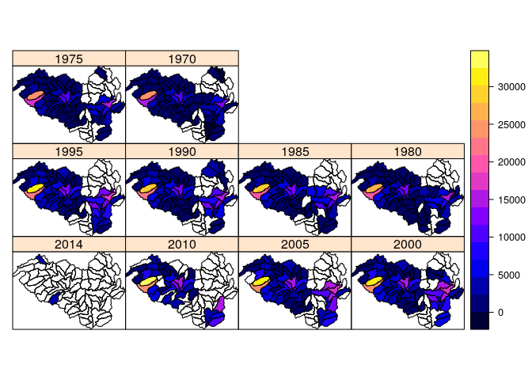

Nutrient Loading Model
======================

### Connect to database

``` r
library(RPostgreSQL)
library(postGIStools)
library(RColorBrewer)

con <- dbConnect(PostgreSQL(), dbname = "WRRI", user = "postgres",
                 host = "postgis",
                 port="5432")
```

### Test Connection

``` r
dbListTables(con) 
```

    ##  [1] "geocode_settings"                       
    ##  [2] "spatial_ref_sys"                        
    ##  [3] "topology"                               
    ##  [4] "layer"                                  
    ##  [5] "geocode_settings_default"               
    ##  [6] "direction_lookup"                       
    ##  [7] "secondary_unit_lookup"                  
    ##  [8] "state_lookup"                           
    ##  [9] "street_type_lookup"                     
    ## [10] "place_lookup"                           
    ## [11] "county_lookup"                          
    ## [12] "countysub_lookup"                       
    ## [13] "zip_lookup_all"                         
    ## [14] "zip_lookup_base"                        
    ## [15] "zip_lookup"                             
    ## [16] "county"                                 
    ## [17] "state"                                  
    ## [18] "place"                                  
    ## [19] "zip_state"                              
    ## [20] "zip_state_loc"                          
    ## [21] "cousub"                                 
    ## [22] "edges"                                  
    ## [23] "addrfeat"                               
    ## [24] "faces"                                  
    ## [25] "featnames"                              
    ## [26] "addr"                                   
    ## [27] "zcta5"                                  
    ## [28] "loader_platform"                        
    ## [29] "loader_variables"                       
    ## [30] "loader_lookuptables"                    
    ## [31] "tract"                                  
    ## [32] "tabblock"                               
    ## [33] "wbd_huc_10_12"                          
    ## [34] "bg"                                     
    ## [35] "pagc_gaz"                               
    ## [36] "pagc_lex"                               
    ## [37] "pagc_rules"                             
    ## [38] "building_footprints"                    
    ## [39] "counties"                               
    ## [40] "falls_lake"                             
    ## [41] "falls_lake_watershed"                   
    ## [42] "flowlines"                              
    ## [43] "jordan_lake_watershed"                  
    ## [44] "nhd_plus_flowlines_piedmont"            
    ## [45] "jordan_lake"                            
    ## [46] "load_monitoring_sites"                  
    ## [47] "nc_stromwater_programs"                 
    ## [48] "public_municipal_stormwater_systems"    
    ## [49] "reservoirs"                             
    ## [50] "sw_culverts_cary"                       
    ## [51] "sw_culverts_greensboro"                 
    ## [52] "sw_culverts_raleigh"                    
    ## [53] "sw_inlets_cary"                         
    ## [54] "sw_inlets_greensboro"                   
    ## [55] "sw_inlets_raleigh"                      
    ## [56] "sw_pipes_cary"                          
    ## [57] "sw_pipes_greensboro"                    
    ## [58] "sw_pipes_raleigh"                       
    ## [59] "sw_waterbodies_bmp_scm_greensboro"      
    ## [60] "type_a_future_public_sewer_systems_2004"
    ## [61] "urban_areas"                            
    ## [62] "ww_tn_point_sources"                    
    ## [63] "ww_tp_point_sources"

**List all tables, and identify geometry column and type for each
table**

``` r
table_info <- get_postgis_query(con, 
  "SELECT f_table_name as table, f_geometry_column as geometry_column, srid, type
  FROM geometry_columns 
  WHERE f_table_schema = 'public' 
  AND f_geometry_column = 'geom'"
)

table_info
```

    ##                                      table geometry_column srid            type
    ## 1                            wbd_huc_10_12            geom 6542    MULTIPOLYGON
    ## 2                      building_footprints            geom 6542    MULTIPOLYGON
    ## 3                                 counties            geom 6542    MULTIPOLYGON
    ## 4                               falls_lake            geom 6542    MULTIPOLYGON
    ## 5                     falls_lake_watershed            geom 6542    MULTIPOLYGON
    ## 6                                flowlines            geom 6542 MULTILINESTRING
    ## 7                    jordan_lake_watershed            geom 6542    MULTIPOLYGON
    ## 8              nhd_plus_flowlines_piedmont            geom 6542 MULTILINESTRING
    ## 9                       stream_buffers_30m            geom    0        GEOMETRY
    ## 10                              huc12_blds            geom 6542    MULTIPOLYGON
    ## 11                             jordan_lake            geom 6542    MULTIPOLYGON
    ## 12                   load_monitoring_sites            geom 6542           POINT
    ## 13                  nc_stromwater_programs            geom 6542    MULTIPOLYGON
    ## 14     public_municipal_stormwater_systems            geom 6542    MULTIPOLYGON
    ## 15                              reservoirs            geom 6542    MULTIPOLYGON
    ## 16                   huc12_blds_in_strbuff            geom 6542    MULTIPOLYGON
    ## 17                        sw_culverts_cary            geom 6542      LINESTRING
    ## 18                  sw_culverts_greensboro            geom 6542      LINESTRING
    ## 19                     sw_culverts_raleigh            geom 6542      LINESTRING
    ## 20                          sw_inlets_cary            geom 6542           POINT
    ## 21                    sw_inlets_greensboro            geom 6542           POINT
    ## 22                       sw_inlets_raleigh            geom 6542           POINT
    ## 23                           sw_pipes_cary            geom 6542      LINESTRING
    ## 24                     sw_pipes_greensboro            geom 6542      LINESTRING
    ## 25                        sw_pipes_raleigh            geom 6542      LINESTRING
    ## 26       sw_waterbodies_bmp_scm_greensboro            geom 6542    MULTIPOLYGON
    ## 27 type_a_future_public_sewer_systems_2004            geom 6542    MULTIPOLYGON
    ## 28                             urban_areas            geom 6542    MULTIPOLYGON
    ## 29                     ww_tn_point_sources            geom 6542           POINT
    ## 30                     ww_tp_point_sources            geom 6542           POINT
    ## 31                        huc12_study_area            geom 6542    MULTIPOLYGON

``` r
table_count <- get_postgis_query(con, 
  "SELECT pgClass.relname   AS tableName,
  pgClass.reltuples AS features
  FROM pg_class as pgClass
  JOIN pg_namespace pgNamespace ON (pgNamespace.oid = pgClass.relnamespace)
  WHERE pgNamespace.nspname = 'public' 
    AND pgClass.relkind='r' 
    AND pgClass.relname != 'spatial_ref_sys'
  ORDER BY features DESC"
)

knitr::kable(head(table_count, 50))
```

| tablename                                     |  features|
|:----------------------------------------------|---------:|
| building\_footprints                          |    521789|
| sw\_pipes\_greensboro                         |     76378|
| sw\_inlets\_greensboro                        |     56321|
| sw\_pipes\_cary                               |     38582|
| sw\_inlets\_cary                              |     34067|
| nhd\_plus\_flowlines\_piedmont                |     26567|
| nc\_stromwater\_programs                      |      1936|
| wbd\_huc\_10\_12                              |      1767|
| sw\_culverts\_greensboro                      |      1411|
| flowlines                                     |      1164|
| sw\_waterbodies\_bmp\_scm\_greensboro         |      1093|
| sw\_culverts\_cary                            |       568|
| public\_municipal\_stormwater\_systems        |       459|
| type\_a\_future\_public\_sewer\_systems\_2004 |       411|
| sw\_pipes\_raleigh                            |       106|
| sw\_inlets\_raleigh                           |        77|
| ww\_tp\_point\_sources                        |        57|
| ww\_tn\_point\_sources                        |        57|
| load\_monitoring\_sites                       |        25|
| counties                                      |         9|
| jordan\_lake                                  |         4|
| falls\_lake\_watershed                        |         1|
| jordan\_lake\_watershed                       |         1|
| falls\_lake                                   |         1|
| urban\_areas                                  |         0|
| reservoirs                                    |         0|
| sw\_culverts\_raleigh                         |         0|

HUC12 Subwatersheds
-------------------

Get HUC12 in study area

``` r
hu12_df <- get_postgis_query(con, 
    "SELECT *
     FROM huc12_study_area",
geom_name = "geom")
```

Get Study area

``` r
aoi_df <- get_postgis_query(con, 
    "SELECT ST_UNION(fl.geom,jl.geom) as geom 
        FROM jordan_lake_watershed as jl, falls_lake_watershed as fl",
geom_name = "geom")
```

Get Counties

``` r
counties_df <- get_postgis_query(con, 
    "SELECT countyname, geom 
        FROM counties",
geom_name = "geom")
```

``` r
plot(counties_df,  border=c('black'))
plot(hu12_df, border="grey", add=T)
plot(aoi_df,  border=c('blue'), add=T)
```


Building Footprints
-------------------

### Aggregated view of building footprints found in the 30m stream buffer by HUC12.

``` r
hu12_building_footprints_30m_stream_buff_df <- get_postgis_query(con, 
    "SELECT * FROM huc12_blds_in_strbuff WHERE hu_12_name = 'Back Creek' AND year_built >= '1970'",
geom_name = "geom")

head(hu12_building_footprints_30m_stream_buff_df)
```


``` r
hu12_building_footprints_df@data$year_built <- as.Date(as.character(hu12_building_footprints_df@data$year_built), format = "%Y")
hu12_building_footprints_30m_stream_buff_df@data$year_built <- as.Date(as.character(hu12_building_footprints_30m_stream_buff_df@data$year_built), format = "%Y")
ggplot() + 
  geom_line(data = hu12_building_footprints_30m_stream_buff_df@data, aes(x = year_built, y = total_buildings), color = "purple") +
  geom_point(data = hu12_building_footprints_30m_stream_buff_df@data, aes(x = year_built, y = total_buildings), color = "purple") +
  geom_line(data = hu12_building_footprints_df@data, aes(x = year_built, y = total_buildings), color = "orange") +
  geom_point(data = hu12_building_footprints_df@data, aes(x = year_built, y = total_buildings), color = "orange") +
  #xlab('Year Built') +
  #ylab('Total Buildings') +
  labs(color="Buiding Inclusion",
       title = "Total Buildings in the Back Creek Subwatershed (HUC12)",
       subtitle = "Cape Fear River Basin (1970 - 2014)",
       x = "Year Built",
       y = "Total Buildings") + theme(legend.position = "bottom")
```



``` r
hu12_building_footprints_df@data$year_built <- as.Date(as.character(hu12_building_footprints_df@data$year_built), format = "%Y")
hu12_building_footprints_30m_stream_buff_df@data$year_built <- as.Date(as.character(hu12_building_footprints_30m_stream_buff_df@data$year_built), format = "%Y")
ggplot() + 
  geom_line(data = hu12_building_footprints_30m_stream_buff_df@data, aes(x = year_built, y = total_buildings), color = "purple") +
  geom_point(data = hu12_building_footprints_30m_stream_buff_df@data, aes(x = year_built, y = total_buildings), color = "purple") +
  labs(color="Buiding Inclusion",
       title = "Total Buildings inside 30m Stream Buffer in the Back Creek (HUC12)",
       subtitle = "1970 - 2014",
       x = "Year Built",
       y = "Total Buildings") + theme(legend.position = "bottom")
```



``` r
ggplot() + 
  geom_line(data = hu12_building_footprints_30m_stream_buff_df@data, aes(x = year_built, y = new_buildings), color = "purple") +
  geom_point(data = hu12_building_footprints_30m_stream_buff_df@data, aes(x = year_built, y = new_buildings), color = "purple") +
  geom_line(data = hu12_building_footprints_df@data, aes(x = year_built, y = new_buildings), color = "orange") +
  geom_point(data = hu12_building_footprints_df@data, aes(x = year_built, y = new_buildings), color = "orange") +
  #xlab('Year Built') +
  #ylab('Total Buildings') +
  labs(color="Buiding Inclusion",
       title = "New Buildings in the Back Creek Subwatershed (HUC12)",
       subtitle = "Cape Fear River Basin (1970 - 2014)",
       x = "Year Built",
       y = "New Buildings") + theme(legend.position = "bottom")
```



``` r
all_hu12_building_footprints_df <- get_postgis_query(con, 
    "SELECT huc_12, hu_12_name, year_built, total_buildings FROM huc12_blds as h12 WHERE  year_built >= '1970' ORDER BY hu_12_name, year_built")
```

``` r
head(all_hu12_building_footprints_df)
```

    ##         huc_12 hu_12_name year_built total_buildings
    ## 1 030300020305 Back Creek       1970            1402
    ## 2 030300020305 Back Creek       1971            1444
    ## 3 030300020305 Back Creek       1972            1504
    ## 4 030300020305 Back Creek       1973            1564
    ## 5 030300020305 Back Creek       1974            1701
    ## 6 030300020305 Back Creek       1975            1779

``` r
#fill(data, ..., .direction = c("down", "up", "downup", "updown"))
ts_buildings <- all_hu12_building_footprints_df  %>% pivot_wider(
  names_from = year_built,
  values_from = total_buildings,
  names_prefix = "year_"#),
  #values_fill = list(total_buildings = 0)
)
```

``` r
all_hu12_building_footprints_geom_df <- get_postgis_query(con, 
    "SELECT DISTINCT huc_12, geom FROM huc12_blds as h12 WHERE year_built >= '1970'"
    ,geom_name = "geom")
```

``` r
h12_buildings_merged <- merge(all_hu12_building_footprints_geom_df, ts_buildings, by.x = "huc_12", by.y = "huc_12")
```

``` r
years <- 1970:2014
map_titles <- paste("year_", years, sep="")
spplot(h12_buildings_merged, rev(map_titles), names.attr = rev(years))
```



``` r
years <- c(1970,1975, 1980,1985, 1990,1995, 2000,2005, 2010,2014)
map_titles <- paste("year_", years, sep="")
plot(counties_df,  border=c('black'))
```



``` r
spplot(h12_buildings_merged, rev(map_titles), names.attr = rev(years), add=T)
```



``` r
#yrs <- 1970:2014 #unique(all_hu12_building_footprints_df$year_built) #
#time <- as.POSIXct(paste(yrs, "-12-07", sep=""), tz = "GMT")
#stfdf = STFDF(all_hu12_building_footprints_geom_df, time, all_hu12_building_footprints_df)
```

``` r
#unique(hu12_building_footprints_df@data$year_built)
#library(lattice)
#library(spacetime)
#library(xts)

#all_hu12_building_footprints_df$year <- as.Date(as.character(all_hu12_building_footprints_df$year_built), format = "%Y")
#yrs <- 1970:2014 #unique(all_hu12_building_footprints_df$year_built) #
#time <- as.POSIXct(paste(yrs, "-12-07", sep=""), tz = "GMT")
#time <- as.POSIXct(yrs, tz = "GMT")

#nrow(object@data) == length(object@sp) * nrow(object@time)


#length(all_hu12_building_footprints_geom_df@polygons)
#print("time")
#length(time)

 
#print("data")
#nrow(all_hu12_building_footprints_df)
#str(time)
#all_hu12_building_footprints_df.st <- STFDF(all_hu12_building_footprints_geom_df, time,data=all_hu12_building_footprints_df)
#hu12_building_footprints_df.st[,,"total_buildings"]
#stplot(all_hu12_building_footprints_df.st,yrs,col.regions = brewer.pal(9, "viridis"))


#R> # deselect District of Columbia, polygon 8, which is not present in Produc:
#R> Produc.st = STFDF(states[-8], time, Produc[order(Produc[2], Produc[1]),])
#R> library(RColorBrewer)
#R> stplot(Produc.st[,,"unemp"], yrs, col.regions = brewer.pal(9, "YlOrRd"),cuts=9)
```
