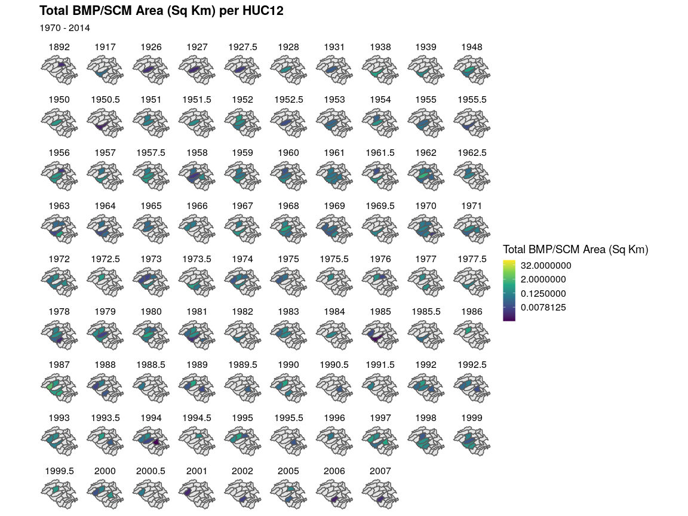
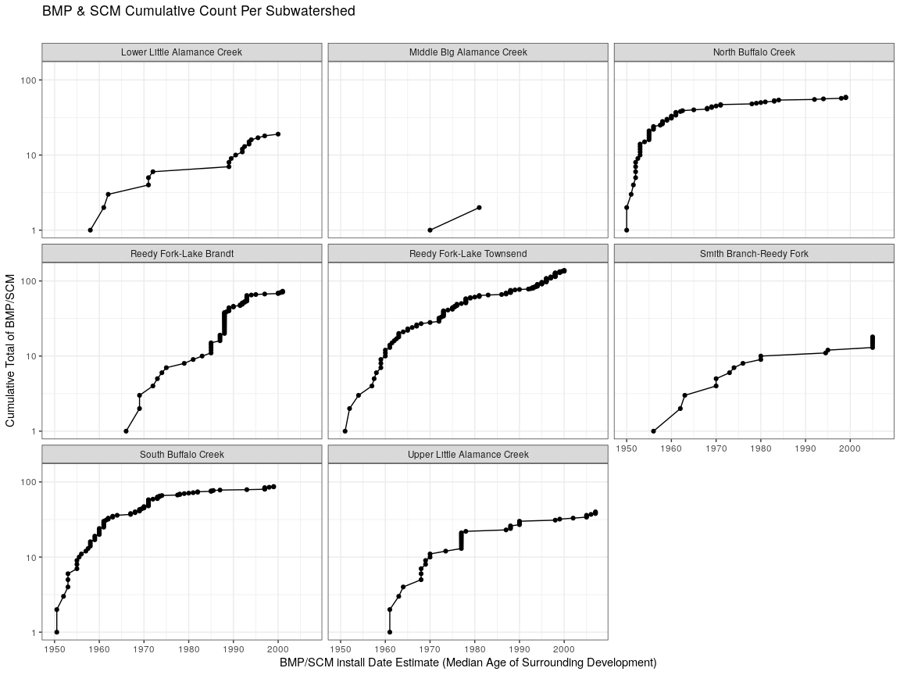
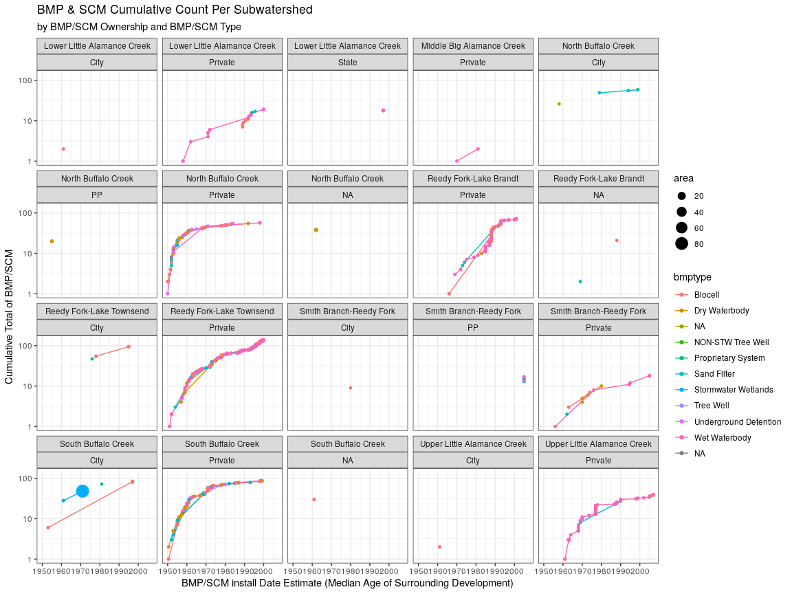
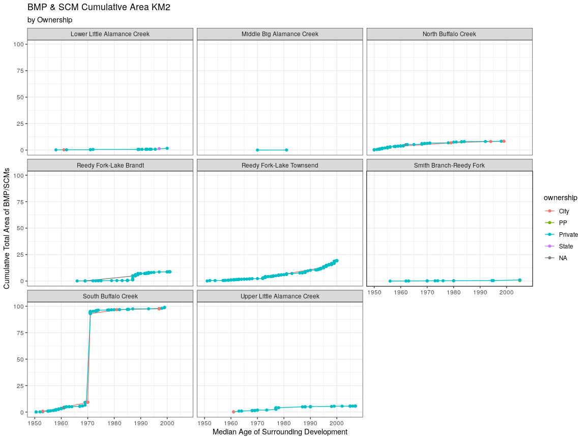
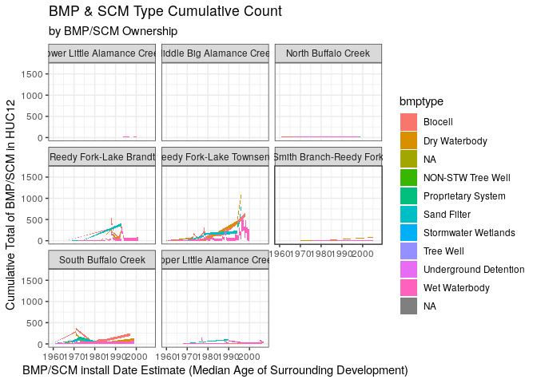
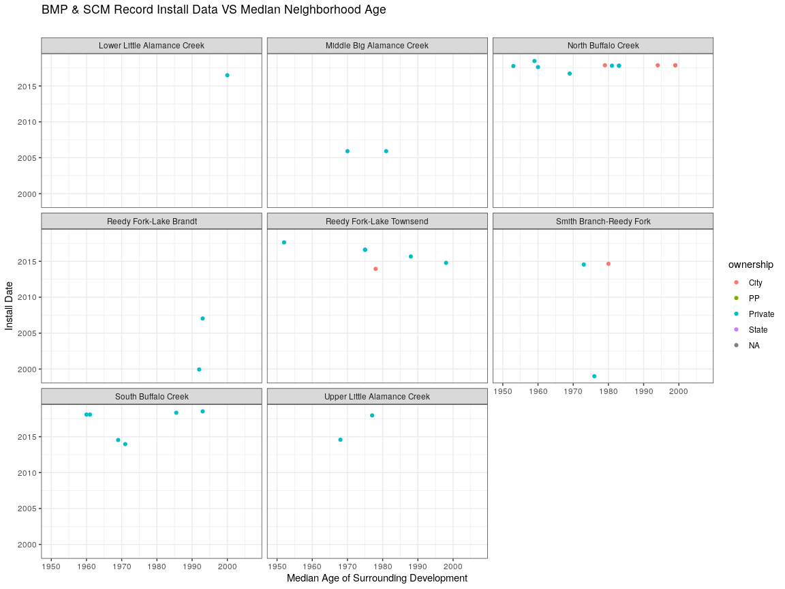
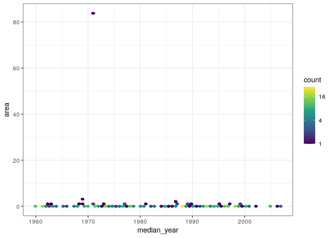
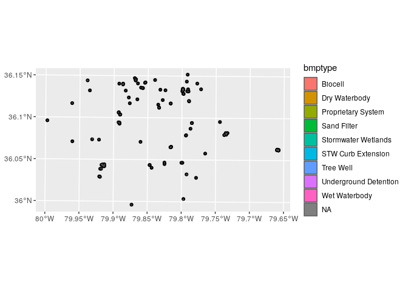
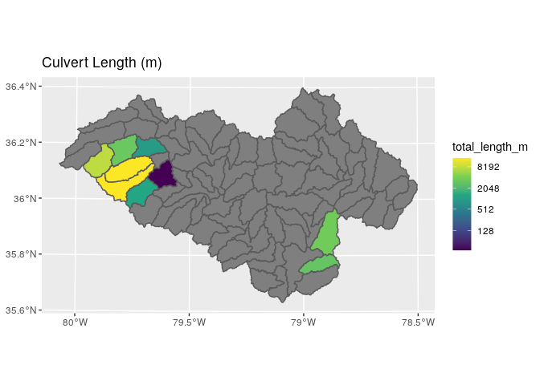

# Nutrient Loading Model

### Connect to database

``` r
library(RPostgreSQL)
library(postGIStools)
library(RColorBrewer)

con <- dbConnect(PostgreSQL(), dbname = "WRRI", user = "postgres",
                 host = "postgis",
                 port="5432")
```

## HUC12 Subwatersheds

Get HUC12 in study area

``` r
hu12_df <- get_postgis_query(con, 
    "SELECT *
     FROM huc12_study_area",
geom_name = "geom")
```

Get Study area

``` r
aoi_df <- get_postgis_query(con, 
    "SELECT ST_UNION(fl.geom,jl.geom) as geom 
        FROM jordan_lake_watershed as jl, falls_lake_watershed as fl",
geom_name = "geom")
```

Get Counties

``` r
counties_df <- get_postgis_query(con, 
    "SELECT countyname, geom 
        FROM counties",
geom_name = "geom")
```

``` r
plot(counties_df,  border=c('black'))
plot(hu12_df, border="grey", add=T)
plot(aoi_df,  border=c('blue'), add=T)
```

<!-- -->

## BMPS & SCM

### City of Greensboro

Calculating the total area of BMP & SCM features by type

``` r
greensboro_bmp_area_df <- get_postgis_query(con,
"SELECT featuretyp, bmptype, (SUM(ST_AREA(geom)) / 1e6) as area
FROM sw_waterbodies_bmp_scm_greensboro
GROUP BY featuretyp, bmptype")

ggplot(greensboro_bmp_area_df, aes(y=bmptype, x=featuretyp, fill= area)) + 
  geom_tile() +
  scale_fill_distiller(palette = "YlGnBu", trans='log2', direction=1) +
  labs(
       title = "BMP & SCM Type Area (km^2)",
       subtitle = "City of Greensboro",
       x = "BMP/SCM Type",
       y = "Feature Type") +
  geom_text(aes(label=sprintf("%0.4f", area)),color="white", face="bold", size=rel(3.5)) 
```

    ## Warning: Ignoring unknown parameters: face

<!-- -->

Calculating the total number of BMP & SCM features by type

``` r
greensboro_bmp_count_df <- get_postgis_query(con,
"SELECT featuretyp, bmptype, COUNT(*) as count
FROM sw_waterbodies_bmp_scm_greensboro
GROUP BY featuretyp, bmptype")

ggplot(greensboro_bmp_count_df, aes(y=bmptype, x=featuretyp, fill= count)) + 
  geom_tile() +
  scale_fill_distiller(palette = "YlGnBu", trans='log2', direction=1) +
  labs(color="Buiding Inclusion",
       title = "BMP & SCM Type Count",
       subtitle = "City of Greensboro",
       x = "BMP/SCM Type",
       y = "Feature Type") +
  geom_text(aes(label= count),color="white", face="bold", size=rel(3.5))
```

    ## Warning: Ignoring unknown parameters: face

<!-- -->

``` r
query = paste("SELECT bmp.featuretyp, bmp.bmptype, (SUM(ST_AREA(bmp.geom)) / 1e6) as area, sa.geom
FROM sw_waterbodies_bmp_scm_greensboro as bmp
JOIN huc12_study_area as sa ON ST_CONTAINS(sa.geom, ST_CENTROID(bmp.geom))
GROUP BY featuretyp, bmptype, sa.geom")

greensboro_bmp_area_gdf <- st_read(con,query = query)
```

Plot the data

``` r
greensboro_bmp_area_gdf %>%
ggplot() +
    facet_grid(.~featuretyp) +
    geom_sf(aes(fill = area)) +
    scale_fill_viridis_c(option = "YlGnBu",trans='log2')
```

    ## Warning in viridisLite::viridis(n, alpha, begin, end, direction, option): Option
    ## 'YlGnBu' does not exist. Defaulting to 'viridis'.

<!-- -->

``` r
greensboro_bmp_area_gdf %>%
  filter(bmptype == 'Dry Waterbody' | bmptype =='Wet Waterbody')  %>%
ggplot() +
    facet_grid(featuretyp~bmptype) +
    geom_sf(aes(fill = area)) +
    scale_fill_viridis_c(trans='log2')
```

<!-- -->

``` r
query = paste('SELECT  
    bmp.assetid,
    bmp.featuretyp,
    bmp.bmptype,
    bmp.installdat,
    bmp.ownership,
    bmp.lifecycle,
    bmp.comments,
    sa.hu_12_name,
    (SUM(ST_AREA(bmp.geom)) / 1e6) as area,
    cast(avg(cast(bf.year_built as integer)) as integer) as mean_year,
    PERCENTILE_CONT(0.5) WITHIN GROUP(ORDER BY cast(bf.year_built as integer)) as median_year,
    sa.geom
FROM sw_waterbodies_bmp_scm_greensboro as bmp
JOIN building_footprints as bf on ST_INTERSECTS(ST_Buffer(bmp.geom, 500), bf.geom)
JOIN huc12_study_area as sa on ST_INTERSECTS(bmp.geom, sa.geom)
GROUP BY 
        bmp.assetid,
        bmp.featuretyp,
        bmp.bmptype,
        bmp.installdat,
        bmp.ownership,
        bmp.lifecycle,
        bmp.comments,
        sa.hu_12_name,
        sa.geom
ORDER BY median_year'
)

greensboro_bmp_year_area_gdf <- st_read(con,query = query)
```

``` r
head(greensboro_bmp_year_area_gdf, 5)
```

    ## Simple feature collection with 5 features and 11 fields
    ## geometry type:  MULTIPOLYGON
    ## dimension:      XY
    ## bbox:           xmin: 527416.3 ymin: 248828.4 xmax: 555505.1 ymax: 274726.2
    ## CRS:            EPSG:6542
    ##    assetid featuretyp            bmptype installdat ownership lifecycle
    ## 1 WTB10727        BMP      Wet Waterbody       <NA>   Private    Active
    ## 2 WTB10669        BMP      Wet Waterbody       <NA>   Private    Active
    ## 3 WTB11612        SCM STW Curb Extension       <NA>      City    Active
    ## 4 WTB11609        SCM          Tree Well       <NA>      City    Active
    ## 5 WTB11607        SCM                 NA       <NA>      City    Active
    ##         comments              hu_12_name        area mean_year median_year
    ## 1             NA Smith Branch-Reedy Fork 0.002149269      1892        1892
    ## 2             NA     South Buffalo Creek 0.040888033      1929        1917
    ## 3 Curb extension     North Buffalo Creek 0.005637612      1933        1926
    ## 4      Tree well     North Buffalo Creek 0.001871456      1933        1926
    ## 5 Curb Extention     North Buffalo Creek 0.007690174      1933        1926
    ##                             geom
    ## 1 MULTIPOLYGON (((550696.9 27...
    ## 2 MULTIPOLYGON (((550365.1 26...
    ## 3 MULTIPOLYGON (((548485.2 26...
    ## 4 MULTIPOLYGON (((548485.2 26...
    ## 5 MULTIPOLYGON (((548485.2 26...

``` r
ggplot(greensboro_bmp_year_area_gdf, aes(x=median_year,y=area, group= bmptype)) + 
  geom_line() +
  #scale_fill_distiller(palette = "YlGnBu", direction=1) +
  labs(color="Buiding Inclusion",
       title = "BMP & SCM Type Count by Year",
       subtitle = "City of Greensboro",
       x = "BMP/SCM Type",
       y = "Feature Type") #+
```

<!-- -->

``` r
  #geom_text(aes(label= area),color="white", face="bold", size=rel(3.5))
```

``` r
counties_sf <- st_read(con, query= paste(
    "SELECT sa.geom 
        FROM counties, huc12_study_area as sa WHERE countyname = 'Guilford' and ST_INTERSECTS(counties.geom, sa.geom)"))

greensboro_bmp_year_area_gdf %>%
ggplot() +
   # facet_grid(year_built~.,rows = vars(5)) +
    geom_sf(data=counties_sf) +
    facet_wrap(median_year~., ncol = 10) +
    geom_sf(aes(fill = area)) +
    scale_fill_viridis_c(name="Total BMP/SCM Area (Sq Km)",trans='log2') + 
    theme_map() +
    labs( title = "Total BMP/SCM Area (Sq Km) per HUC12",
       subtitle = "1970 - 2014")
```



``` r
#head(greensboro_bmp_year_area_gdf)
greensboro_bmp_year_area_gdf %>%
  filter(median_year >= 1950) %>%
  group_by(hu_12_name) %>% mutate(count=row_number(), cumarea=cumsum(area)) %>%
  ggplot(aes(x=median_year,y=count)) + 
  facet_wrap(hu_12_name~.) +
  geom_line(aes(x=median_year,y=count)) + 
  geom_point(aes(x=median_year,y=count)) + 
  scale_fill_continuous(type = "viridis") +
  theme_bw() +
  scale_y_continuous(trans='log10') +
  #scale_fill_distiller(palette = "YlGnBu", direction=1) +
  labs(
       title = "BMP & SCM Cumulative Count Per Subwatershed",
       subtitle = "",
       x = "BMP/SCM install Date Estimate (Median Age of Surrounding Development)",
       y = "Cumulative Total of BMP/SCM"
      )
```



``` r
#head(greensboro_bmp_year_area_gdf)
greensboro_bmp_year_area_gdf %>%
  filter(median_year >= 1950) %>%
  group_by(hu_12_name) %>% mutate(count=row_number(), cumarea=cumsum(area)) %>%
  ggplot(aes(x=median_year,y=count)) + 
  facet_wrap(hu_12_name~ownership) +
  geom_line(aes(x=median_year,y=count, group=bmptype, color=bmptype)) + 
  geom_point(aes(x=median_year,y=count, group=bmptype, color=bmptype, cex=area)) + 
  scale_fill_continuous(type = "viridis") +
  theme_bw() +
  scale_y_continuous(trans='log10') +
  #scale_fill_distiller(palette = "YlGnBu", direction=1) +
  labs(
       title = "BMP & SCM Cumulative Count Per Subwatershed",
       subtitle = "by BMP/SCM Ownership and BMP/SCM Type",
       x = "BMP/SCM install Date Estimate (Median Age of Surrounding Development)",
       y = "Cumulative Total of BMP/SCM"
      )
```

    ## geom_path: Each group consists of only one observation. Do you need to adjust
    ## the group aesthetic?
    ## geom_path: Each group consists of only one observation. Do you need to adjust
    ## the group aesthetic?
    ## geom_path: Each group consists of only one observation. Do you need to adjust
    ## the group aesthetic?
    ## geom_path: Each group consists of only one observation. Do you need to adjust
    ## the group aesthetic?
    ## geom_path: Each group consists of only one observation. Do you need to adjust
    ## the group aesthetic?
    ## geom_path: Each group consists of only one observation. Do you need to adjust
    ## the group aesthetic?
    ## geom_path: Each group consists of only one observation. Do you need to adjust
    ## the group aesthetic?
    ## geom_path: Each group consists of only one observation. Do you need to adjust
    ## the group aesthetic?



``` r
greensboro_bmp_year_area_gdf %>%
  filter(median_year >= 1950) %>%
  group_by(hu_12_name) %>% mutate(count=row_number(), cumarea=cumsum(area)) %>%
  ggplot(aes(x=median_year,y=count)) + 
  facet_wrap(hu_12_name~.) +
  geom_line(aes(x=median_year,y=count, group=bmptype, color=bmptype)) + 
  geom_point(aes(x=median_year,y=count, group=bmptype, color=bmptype, cex=cumarea)) + 
  scale_fill_continuous(type = "viridis") +
  theme_bw() +
  scale_y_continuous(trans='log2') +
  #scale_fill_distiller(palette = "YlGnBu", direction=1) +
  labs(
       title = "BMP & SCM Type Cumulative Count",
       subtitle = "",
       x = "BMP/SCM install Date Estimate (Median Age of Surrounding Development)",
       y = "Cumulative Total of BMP/SCM in HUC12"
      )
```

<!-- -->

``` r
greensboro_bmp_year_area_gdf %>%
  filter(median_year >= 1950) %>%
  group_by(hu_12_name) %>% mutate(cumarea=cumsum(area)) %>%
  ggplot(aes(x=median_year)) + 
  facet_wrap(hu_12_name~.) +
  geom_line(aes(x=median_year,y=cumarea, group=ownership, color=ownership)) + 
  geom_point(aes(x=median_year,y=cumarea, group=ownership, color=ownership)) + 
  scale_fill_continuous(type = "viridis") +
  theme_bw() +
  #scale_y_continuous(trans='log2') +
  #scale_fill_distiller(palette = "YlGnBu", direction=1) +
  labs(
       title = "BMP & SCM Cumulative Area KM2",
       subtitle = "by Ownership",
       x = "Median Age of Surrounding Development",
       y = "Cumulative Total Area of BMP/SCMs"
      )
```



``` r
greensboro_bmp_year_area_gdf %>%
  filter(median_year >= 1960) %>%
  group_by(hu_12_name) %>% mutate(count=row_number(), cumarea=cumsum(area)) %>%
  ggplot(aes(x=median_year)) + 
  facet_wrap(hu_12_name~.) +
  geom_area(aes(x=median_year,y=count, fill=bmptype)) + 
  #geom_point(aes(x=median_year,y=count, group=bmptype, color=bmptype, cex=cumarea)) + 
  #scale_fill_continuous(type = "viridis") +
  theme_bw() +
  #scale_y_continuous(trans='log2') +
  #scale_fill_distiller(palette = "YlGnBu", direction=1) +
  labs(
       title = "BMP & SCM Type Cumulative Count",
       subtitle = "by BMP/SCM Ownership",
       x = "BMP/SCM install Date Estimate (Median Age of Surrounding Development)",
       y = "Cumulative Total of BMP/SCM in HUC12"
      )
```

<!-- -->

``` r
greensboro_bmp_year_area_gdf %>%
  filter(median_year >= 1950) %>%
  group_by(hu_12_name) %>% mutate(count=row_number(), cumarea=cumsum(area)) %>%
  ggplot(aes(x=median_year)) + 
  facet_wrap(hu_12_name~.) +
  #geom_line(aes(x=median_year,y=installdat, group=ownership, color=ownership)) + 
  geom_point(aes(x=median_year,y=installdat, group=ownership, color=ownership)) + 
  scale_fill_continuous(type = "viridis") +
  theme_bw() +
  #scale_y_continuous(trans='log2') +
  #scale_fill_distiller(palette = "YlGnBu", direction=1) +
  labs(
       title = "BMP & SCM Record Install Data VS Median Neighborhood Age",
       subtitle = "",
       x = "Median Age of Surrounding Development",
       y = "Install Date"
      )
```

    ## Warning: Removed 403 rows containing missing values (geom_point).



``` r
greensboro_bmp_year_area_gdf %>%
  filter(median_year >= 1960) %>%
  ggplot(aes(x=median_year, y=area) ) +
    geom_hex(bins = 70) +
    scale_fill_continuous(type = "viridis",trans='log2') +
    theme_bw()
```

<!-- -->

## BMP Inlets

``` r
query = paste('SELECT 
    inlet.assetid as inlet_assetid,
    bmp.objectid,
    bmp.installdat,
    bmp.bmptype,
    bmp.featuretyp,
    bmp.outletdiam,
    inlet.geom
FROM sw_inlets_greensboro as inlet, sw_waterbodies_bmp_scm_greensboro as bmp
WHERE ST_Intersects(inlet.geom, bmp.geom)')

bmp_inlets_gdf <- st_read(con,query = query)

query = paste('SELECT 
    bmp.*
FROM sw_inlets_greensboro as inlet, sw_waterbodies_bmp_scm_greensboro as bmp
WHERE ST_Intersects(inlet.geom, bmp.geom)')

bmps_gdf <- st_read(con,query = query)
```

``` r
bmp_inlets_gdf %>%
ggplot() +
    geom_sf() +
    geom_sf(data=bmps_gdf, aes(fill=bmptype))
```

<!-- -->

``` r
    #scale_fill_viridis_c(option = "plasma")
```

## Culverts

Calculate the total length of
culverts

``` r
huc12_culverts_df <- st_read(con, query=paste("SELECT sa.huc_12,sa.hu_12_name,sa.hu_10_name, 
    (
        sum(COALESCE(ST_Length(gc.geom),0) + 
            COALESCE(ST_Length(cc.geom),0) +
            COALESCE(ST_Length(rc.geom),0)
           )
    ) AS total_length_m,
    sa.geom
FROM huc12_study_area as sa
LEFT JOIN sw_culverts_greensboro as gc ON ST_CONTAINS(sa.geom, gc.geom)
LEFT JOIN sw_culverts_cary as cc ON ST_CONTAINS(sa.geom, cc.geom)
LEFT JOIN sw_culverts_raleigh as rc ON ST_CONTAINS(sa.geom, rc.geom)

GROUP BY sa.huc_12, sa.hu_12_name,sa.hu_10_name,  sa.geom"))
```

``` r
#spplot(huc12_culverts_df,"total_length_m", main="Culvert Length (m)")

huc12_culverts_df %>%
ggplot() +
    #facet_grid(.~featuretyp) +
    geom_sf(aes(fill = total_length_m)) +
    scale_fill_viridis_c(option = "YlGnBu",trans='log2') +
    labs(color="Length (m)",
       title = "Culvert Length (m)") 
```

    ## Warning in viridisLite::viridis(n, alpha, begin, end, direction, option): Option
    ## 'YlGnBu' does not exist. Defaulting to 'viridis'.

    ## Warning: Transformation introduced infinite values in discrete y-axis

<!-- -->

``` r
#Import libraries
#library(spatstat)
#library(rgdal)

#huc12_culverts_df <- get_postgis_query(con, 
#geom_name = "geom")
#Convert roads spatial lines data frame to psp object
#psp_culvert_ms <- st_cast(huc12_culverts_df,"MULTILINESTRING")
#psp_culvert_ls <- st_cast(psp_culvert_ms,"LINESTRING")
#class(psp_culvert_ls)
#psp_culvert <- as.psp(huc12_culverts_df)
#Apply kernel density, however this is where I am unsure of the arguments
#culvert_density <- spatstat::density.psp(psp_culvert, sigma = 0.01, eps = 500) 
```
