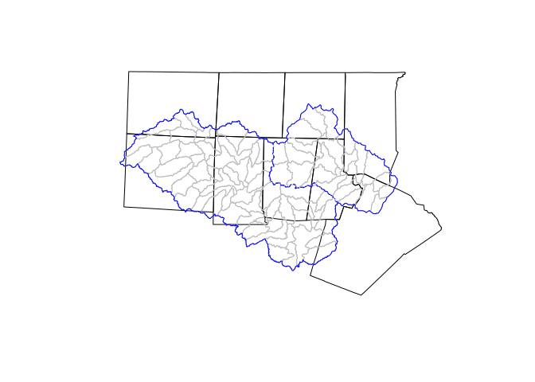
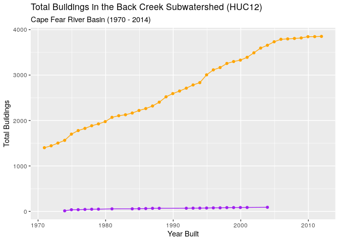
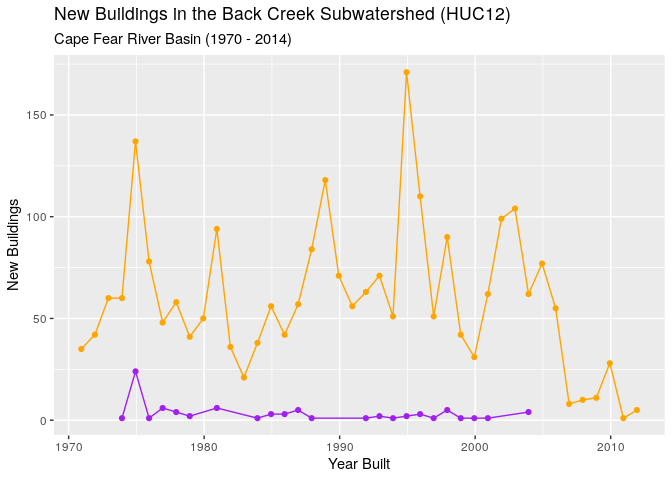
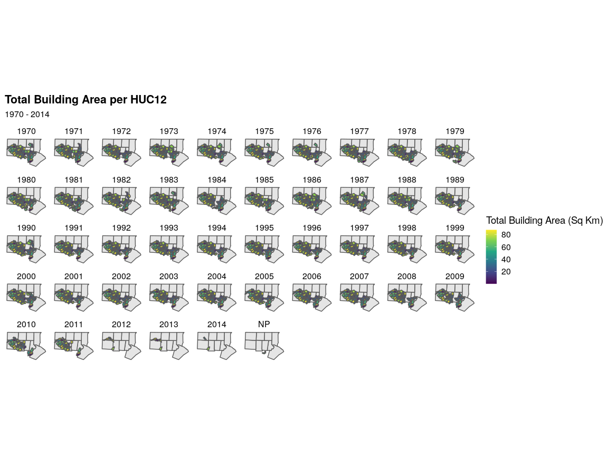
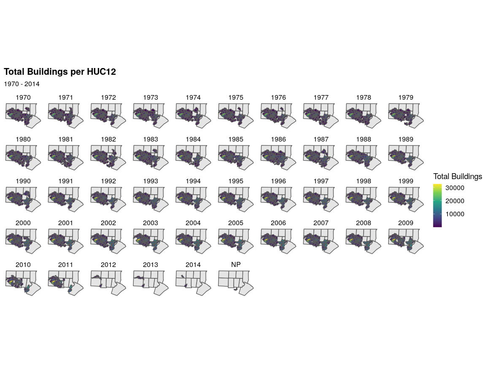
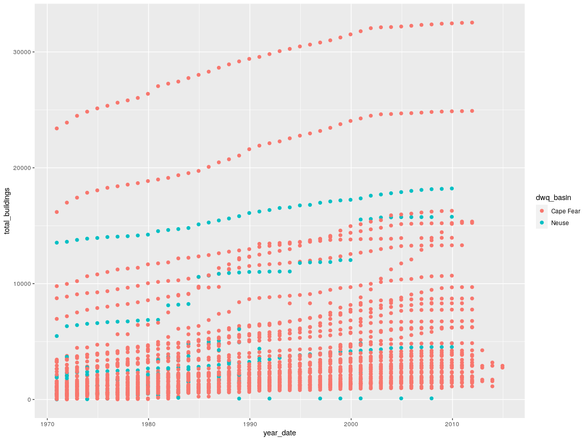

# Nutrient Loading Model

### Connect to database

``` r
library(RPostgreSQL)
library(postGIStools)
library(RColorBrewer)

con <- dbConnect(PostgreSQL(), dbname = "WRRI", user = "postgres",
                 host = "postgis",
                 port="5432")
```

### Test Connection

**List all tables, and identify geometry column and type for each
table**

``` r
table_info <- get_postgis_query(con, 
  "SELECT f_table_name as table, f_geometry_column as geometry_column, srid, type
  FROM geometry_columns 
  WHERE f_table_schema = 'public' 
  AND f_geometry_column = 'geom'"
)


knitr::kable(head(table_info, 50))
```

| table                                         | geometry\_column | srid | type            |
| :-------------------------------------------- | :--------------- | ---: | :-------------- |
| wbd\_huc\_10\_12                              | geom             | 6542 | MULTIPOLYGON    |
| building\_footprints                          | geom             | 6542 | MULTIPOLYGON    |
| counties                                      | geom             | 6542 | MULTIPOLYGON    |
| falls\_lake                                   | geom             | 6542 | MULTIPOLYGON    |
| falls\_lake\_watershed                        | geom             | 6542 | MULTIPOLYGON    |
| flowlines                                     | geom             | 6542 | MULTILINESTRING |
| jordan\_lake\_watershed                       | geom             | 6542 | MULTIPOLYGON    |
| huc12\_study\_area                            | geom             | 6542 | MULTIPOLYGON    |
| huc12\_blds                                   | geom             | 6542 | MULTIPOLYGON    |
| nhd\_plus\_flowlines\_piedmont                | geom             | 6542 | MULTILINESTRING |
| stream\_buffers\_30m                          | geom             |    0 | GEOMETRY        |
| huc12\_blds\_in\_strbuff                      | geom             | 6542 | MULTIPOLYGON    |
| jordan\_lake                                  | geom             | 6542 | MULTIPOLYGON    |
| load\_monitoring\_sites                       | geom             | 6542 | POINT           |
| nc\_stromwater\_programs                      | geom             | 6542 | MULTIPOLYGON    |
| public\_municipal\_stormwater\_systems        | geom             | 6542 | MULTIPOLYGON    |
| reservoirs                                    | geom             | 6542 | MULTIPOLYGON    |
| sw\_culverts\_cary                            | geom             | 6542 | LINESTRING      |
| sw\_culverts\_greensboro                      | geom             | 6542 | LINESTRING      |
| sw\_culverts\_raleigh                         | geom             | 6542 | LINESTRING      |
| sw\_inlets\_cary                              | geom             | 6542 | POINT           |
| sw\_inlets\_greensboro                        | geom             | 6542 | POINT           |
| sw\_inlets\_raleigh                           | geom             | 6542 | POINT           |
| sw\_pipes\_cary                               | geom             | 6542 | LINESTRING      |
| sw\_pipes\_greensboro                         | geom             | 6542 | LINESTRING      |
| sw\_pipes\_raleigh                            | geom             | 6542 | LINESTRING      |
| sw\_waterbodies\_bmp\_scm\_greensboro         | geom             | 6542 | MULTIPOLYGON    |
| type\_a\_future\_public\_sewer\_systems\_2004 | geom             | 6542 | MULTIPOLYGON    |
| urban\_areas                                  | geom             | 6542 | MULTIPOLYGON    |
| ww\_tn\_point\_sources                        | geom             | 6542 | POINT           |
| ww\_tp\_point\_sources                        | geom             | 6542 | POINT           |

``` r
table_count <- get_postgis_query(con, 
  "SELECT pgClass.relname   AS tableName,
  pgClass.reltuples AS features
  FROM pg_class as pgClass
  JOIN pg_namespace pgNamespace ON (pgNamespace.oid = pgClass.relnamespace)
  WHERE pgNamespace.nspname = 'public' 
    AND pgClass.relkind='r' 
    AND pgClass.relname != 'spatial_ref_sys'
  ORDER BY features DESC"
)

knitr::kable(head(table_count, 50))
```

| tablename                                     | features |
| :-------------------------------------------- | -------: |
| building\_footprints                          |   521789 |
| sw\_pipes\_greensboro                         |    76378 |
| sw\_inlets\_greensboro                        |    56321 |
| sw\_pipes\_cary                               |    38582 |
| sw\_inlets\_cary                              |    34067 |
| nhd\_plus\_flowlines\_piedmont                |    26567 |
| nc\_stromwater\_programs                      |     1936 |
| wbd\_huc\_10\_12                              |     1767 |
| sw\_culverts\_greensboro                      |     1411 |
| flowlines                                     |     1164 |
| sw\_waterbodies\_bmp\_scm\_greensboro         |     1093 |
| sw\_culverts\_cary                            |      568 |
| public\_municipal\_stormwater\_systems        |      459 |
| type\_a\_future\_public\_sewer\_systems\_2004 |      411 |
| sw\_pipes\_raleigh                            |      106 |
| sw\_inlets\_raleigh                           |       77 |
| ww\_tp\_point\_sources                        |       57 |
| ww\_tn\_point\_sources                        |       57 |
| load\_monitoring\_sites                       |       25 |
| counties                                      |        9 |
| jordan\_lake                                  |        4 |
| falls\_lake\_watershed                        |        1 |
| jordan\_lake\_watershed                       |        1 |
| falls\_lake                                   |        1 |
| urban\_areas                                  |        0 |
| reservoirs                                    |        0 |
| sw\_culverts\_raleigh                         |        0 |

## HUC12 Subwatersheds

Get HUC12 in study area

``` r
hu12_df <- get_postgis_query(con, 
    "SELECT *
     FROM huc12_study_area",
geom_name = "geom")
```

Get Study area

``` r
aoi_df <- get_postgis_query(con, 
    "SELECT ST_UNION(fl.geom,jl.geom) as geom 
        FROM jordan_lake_watershed as jl, falls_lake_watershed as fl",
geom_name = "geom")
```

Get Counties

``` r
counties_df <- get_postgis_query(con, 
    "SELECT countyname, geom 
        FROM counties",
geom_name = "geom")
```

``` r
query = paste("SELECT countyname, geom FROM counties")

counties_sf <- st_read(con,query = query)
```

``` r
#counties_sf  %>%
#  ggplot() +
#   geom_sf(aes()) +
plot(counties_df,  border=c('black'))
plot(hu12_df, border="grey", add=T)
plot(aoi_df,  border=c('blue'), add=T)
```

<!-- -->

## Building Footprints

### Aggregated view of building footprints found in the 30m stream buffer by HUC12.

``` r
hu12_building_footprints_30m_stream_buff_df <- get_postgis_query(con, 
    "SELECT * FROM huc12_blds_in_strbuff WHERE hu_12_name = 'Back Creek' AND year_built >= '1970'",
geom_name = "geom")


knitr::kable(head(hu12_building_footprints_30m_stream_buff_df@data,25))
```

| huc\_12      | hu\_12\_name | huc\_10    | hu\_10\_name       | dwq\_basin | huc\_8   |  dig\_8 | states | meta\_id | fid | year\_built | new\_buildings | total\_buildings | total\_building\_sq\_km | total\_heated\_sq\_km |
| :----------- | :----------- | :--------- | :----------------- | :--------- | :------- | ------: | :----- | :------- | --: | :---------- | -------------: | ---------------: | ----------------------: | --------------------: |
| 030300020305 | Back Creek   | 0303000203 | Big Alamance Creek | Cape Fear  | 03030002 | 3030002 | NC     | NC01     | 837 | 1973        |              1 |               13 |               0.0016391 |             0.0012316 |
| 030300020305 | Back Creek   | 0303000203 | Big Alamance Creek | Cape Fear  | 03030002 | 3030002 | NC     | NC01     | 837 | 1974        |             24 |               37 |               0.0035933 |             0.0028443 |
| 030300020305 | Back Creek   | 0303000203 | Big Alamance Creek | Cape Fear  | 03030002 | 3030002 | NC     | NC01     | 837 | 1975        |              1 |               38 |               0.0037580 |             0.0030485 |
| 030300020305 | Back Creek   | 0303000203 | Big Alamance Creek | Cape Fear  | 03030002 | 3030002 | NC     | NC01     | 837 | 1976        |              6 |               44 |               0.0048465 |             0.0037451 |
| 030300020305 | Back Creek   | 0303000203 | Big Alamance Creek | Cape Fear  | 03030002 | 3030002 | NC     | NC01     | 837 | 1977        |              4 |               48 |               0.0056653 |             0.0045114 |
| 030300020305 | Back Creek   | 0303000203 | Big Alamance Creek | Cape Fear  | 03030002 | 3030002 | NC     | NC01     | 837 | 1978        |              2 |               50 |               0.0061424 |             0.0049654 |
| 030300020305 | Back Creek   | 0303000203 | Big Alamance Creek | Cape Fear  | 03030002 | 3030002 | NC     | NC01     | 837 | 1980        |              6 |               56 |               0.0067913 |             0.0054626 |
| 030300020305 | Back Creek   | 0303000203 | Big Alamance Creek | Cape Fear  | 03030002 | 3030002 | NC     | NC01     | 837 | 1983        |              1 |               57 |               0.0069068 |             0.0055568 |
| 030300020305 | Back Creek   | 0303000203 | Big Alamance Creek | Cape Fear  | 03030002 | 3030002 | NC     | NC01     | 837 | 1984        |              3 |               60 |               0.0072733 |             0.0059024 |
| 030300020305 | Back Creek   | 0303000203 | Big Alamance Creek | Cape Fear  | 03030002 | 3030002 | NC     | NC01     | 837 | 1985        |              3 |               63 |               0.0077402 |             0.0064102 |
| 030300020305 | Back Creek   | 0303000203 | Big Alamance Creek | Cape Fear  | 03030002 | 3030002 | NC     | NC01     | 837 | 1986        |              5 |               68 |               0.0088879 |             0.0075884 |
| 030300020305 | Back Creek   | 0303000203 | Big Alamance Creek | Cape Fear  | 03030002 | 3030002 | NC     | NC01     | 837 | 1987        |              1 |               69 |               0.0091444 |             0.0078077 |
| 030300020305 | Back Creek   | 0303000203 | Big Alamance Creek | Cape Fear  | 03030002 | 3030002 | NC     | NC01     | 837 | 1991        |              1 |               70 |               0.0095407 |             0.0080931 |
| 030300020305 | Back Creek   | 0303000203 | Big Alamance Creek | Cape Fear  | 03030002 | 3030002 | NC     | NC01     | 837 | 1992        |              2 |               72 |               0.0098915 |             0.0083940 |
| 030300020305 | Back Creek   | 0303000203 | Big Alamance Creek | Cape Fear  | 03030002 | 3030002 | NC     | NC01     | 837 | 1993        |              1 |               73 |               0.0100065 |             0.0084980 |
| 030300020305 | Back Creek   | 0303000203 | Big Alamance Creek | Cape Fear  | 03030002 | 3030002 | NC     | NC01     | 837 | 1994        |              2 |               75 |               0.0104665 |             0.0088577 |
| 030300020305 | Back Creek   | 0303000203 | Big Alamance Creek | Cape Fear  | 03030002 | 3030002 | NC     | NC01     | 837 | 1995        |              3 |               78 |               0.0113854 |             0.0102345 |
| 030300020305 | Back Creek   | 0303000203 | Big Alamance Creek | Cape Fear  | 03030002 | 3030002 | NC     | NC01     | 837 | 1996        |              1 |               79 |               0.0115479 |             0.0103658 |
| 030300020305 | Back Creek   | 0303000203 | Big Alamance Creek | Cape Fear  | 03030002 | 3030002 | NC     | NC01     | 837 | 1997        |              5 |               84 |               0.0132976 |             0.0117388 |
| 030300020305 | Back Creek   | 0303000203 | Big Alamance Creek | Cape Fear  | 03030002 | 3030002 | NC     | NC01     | 837 | 1998        |              1 |               85 |               0.0135962 |             0.0120069 |
| 030300020305 | Back Creek   | 0303000203 | Big Alamance Creek | Cape Fear  | 03030002 | 3030002 | NC     | NC01     | 837 | 1999        |              1 |               86 |               0.0138817 |             0.0121932 |
| 030300020305 | Back Creek   | 0303000203 | Big Alamance Creek | Cape Fear  | 03030002 | 3030002 | NC     | NC01     | 837 | 2000        |              1 |               87 |               0.0140018 |             0.0122973 |
| 030300020305 | Back Creek   | 0303000203 | Big Alamance Creek | Cape Fear  | 03030002 | 3030002 | NC     | NC01     | 837 | 2003        |              4 |               91 |               0.0148751 |             0.0129894 |

``` r
hu12_building_footprints_df <- get_postgis_query(con, 
    "SELECT * FROM huc12_blds WHERE hu_12_name = 'Back Creek' AND year_built >= '1970' AND dwq_basin = 'Cape Fear'",
geom_name = "geom")

knitr::kable(head(hu12_building_footprints_df@data,25))
```

| huc\_12      | hu\_12\_name | year\_built | hu\_10\_name       | dwq\_basin | new\_buildings | total\_buildings | total\_building\_sq\_km | total\_heated\_sq\_km |
| :----------- | :----------- | :---------- | :----------------- | :--------- | -------------: | ---------------: | ----------------------: | --------------------: |
| 030300020305 | Back Creek   | 1970        | Big Alamance Creek | Cape Fear  |             35 |             1402 |               0.2673323 |             0.2489142 |
| 030300020305 | Back Creek   | 1971        | Big Alamance Creek | Cape Fear  |             42 |             1444 |               0.2752382 |             0.2553390 |
| 030300020305 | Back Creek   | 1972        | Big Alamance Creek | Cape Fear  |             60 |             1504 |               0.2919590 |             0.2726737 |
| 030300020305 | Back Creek   | 1973        | Big Alamance Creek | Cape Fear  |             60 |             1564 |               0.3078937 |             0.2888187 |
| 030300020305 | Back Creek   | 1974        | Big Alamance Creek | Cape Fear  |            137 |             1701 |               0.3277582 |             0.3078580 |
| 030300020305 | Back Creek   | 1975        | Big Alamance Creek | Cape Fear  |             78 |             1779 |               0.3413022 |             0.3192965 |
| 030300020305 | Back Creek   | 1976        | Big Alamance Creek | Cape Fear  |             48 |             1827 |               0.3500342 |             0.3261627 |
| 030300020305 | Back Creek   | 1977        | Big Alamance Creek | Cape Fear  |             58 |             1885 |               0.3629237 |             0.3367470 |
| 030300020305 | Back Creek   | 1978        | Big Alamance Creek | Cape Fear  |             41 |             1926 |               0.3743132 |             0.3466809 |
| 030300020305 | Back Creek   | 1979        | Big Alamance Creek | Cape Fear  |             50 |             1976 |               0.3857608 |             0.3555648 |
| 030300020305 | Back Creek   | 1980        | Big Alamance Creek | Cape Fear  |             94 |             2070 |               0.4014294 |             0.3734116 |
| 030300020305 | Back Creek   | 1981        | Big Alamance Creek | Cape Fear  |             36 |             2106 |               0.4083906 |             0.3798164 |
| 030300020305 | Back Creek   | 1982        | Big Alamance Creek | Cape Fear  |             21 |             2127 |               0.4129652 |             0.3851144 |
| 030300020305 | Back Creek   | 1983        | Big Alamance Creek | Cape Fear  |             38 |             2165 |               0.4198447 |             0.3904139 |
| 030300020305 | Back Creek   | 1984        | Big Alamance Creek | Cape Fear  |             56 |             2221 |               0.4316939 |             0.4027277 |
| 030300020305 | Back Creek   | 1985        | Big Alamance Creek | Cape Fear  |             42 |             2263 |               0.4395446 |             0.4102061 |
| 030300020305 | Back Creek   | 1986        | Big Alamance Creek | Cape Fear  |             57 |             2320 |               0.4511091 |             0.4209417 |
| 030300020305 | Back Creek   | 1987        | Big Alamance Creek | Cape Fear  |             84 |             2404 |               0.4812036 |             0.4488603 |
| 030300020305 | Back Creek   | 1988        | Big Alamance Creek | Cape Fear  |            118 |             2522 |               0.5082438 |             0.4736347 |
| 030300020305 | Back Creek   | 1989        | Big Alamance Creek | Cape Fear  |             71 |             2593 |               0.5327266 |             0.4951889 |
| 030300020305 | Back Creek   | 1990        | Big Alamance Creek | Cape Fear  |             56 |             2649 |               0.5508810 |             0.5143029 |
| 030300020305 | Back Creek   | 1991        | Big Alamance Creek | Cape Fear  |             63 |             2712 |               0.5671361 |             0.5352441 |
| 030300020305 | Back Creek   | 1992        | Big Alamance Creek | Cape Fear  |             71 |             2783 |               0.5869064 |             0.5579989 |
| 030300020305 | Back Creek   | 1993        | Big Alamance Creek | Cape Fear  |             51 |             2834 |               0.6098173 |             0.5989042 |
| 030300020305 | Back Creek   | 1994        | Big Alamance Creek | Cape Fear  |            171 |             3005 |               0.6539141 |             0.6544363 |

``` r
colors <- c("All Building Footprints" = "orange", "Building Footprints inside 30m Stream Buffer" = "purple")
hu12_building_footprints_df@data$year_built <- as.Date(as.character(hu12_building_footprints_df@data$year_built), format = "%Y")
hu12_building_footprints_30m_stream_buff_df@data$year_built <- as.Date(as.character(hu12_building_footprints_30m_stream_buff_df@data$year_built), format = "%Y")

ggplot() + 
  geom_line(data = hu12_building_footprints_30m_stream_buff_df@data, aes(x = year_built, y = total_buildings), color = "purple") +
  geom_point(data = hu12_building_footprints_30m_stream_buff_df@data, aes(x = year_built, y = total_buildings), color = "purple") +
  geom_line(data = hu12_building_footprints_df@data, aes(x = year_built, y = total_buildings), color = "orange") +
  geom_point(data = hu12_building_footprints_df@data, aes(x = year_built, y = total_buildings), color = "orange") +
  #xlab('Year Built') +
  #ylab('Total Buildings') +
  labs(color="Buiding Inclusion",
       title = "Total Buildings in the Back Creek Subwatershed (HUC12)",
       subtitle = "Cape Fear River Basin (1970 - 2014)",
       x = "Year Built",
       y = "Total Buildings")  +
  scale_color_manual(values = colors) + theme(legend.position = "bottom")
```

<!-- -->

``` r
hu12_building_footprints_df@data$year_built <- as.Date(as.character(hu12_building_footprints_df@data$year_built), format = "%Y")
hu12_building_footprints_30m_stream_buff_df@data$year_built <- as.Date(as.character(hu12_building_footprints_30m_stream_buff_df@data$year_built), format = "%Y")
ggplot(hu12_building_footprints_30m_stream_buff_df@data, aes(x = year_built, y = total_buildings)) + 
  geom_line(color = "purple") +
  geom_point(data = hu12_building_footprints_30m_stream_buff_df@data, aes(x = year_built, y = total_buildings), color = "purple") +
  labs(color="Buiding Inclusion",
       title = "Total Buildings inside 30m Stream Buffer in the Back Creek (HUC12)",
       subtitle = "1970 - 2014",
       x = "Year Built",
       y = "Total Buildings") + theme(legend.position = "bottom")
```

<!-- -->

``` r
ggplot() + 
  geom_line(data = hu12_building_footprints_30m_stream_buff_df@data, aes(x = year_built, y = new_buildings), color = "purple") +
  geom_point(data = hu12_building_footprints_30m_stream_buff_df@data, aes(x = year_built, y = new_buildings), color = "purple") +
  geom_line(data = hu12_building_footprints_df@data, aes(x = year_built, y = new_buildings), color = "orange") +
  geom_point(data = hu12_building_footprints_df@data, aes(x = year_built, y = new_buildings), color = "orange") +
  #xlab('Year Built') +
  #ylab('Total Buildings') +
  labs(color="Buiding Inclusion",
       title = "New Buildings in the Back Creek Subwatershed (HUC12)",
       subtitle = "Cape Fear River Basin (1970 - 2014)",
       x = "Year Built",
       y = "New Buildings") + theme(legend.position = "bottom")
```

<!-- -->

``` r
all_hu12_building_footprints_df <- get_postgis_query(con, 
    "SELECT huc_12, hu_12_name, year_built, total_buildings FROM huc12_blds as h12 WHERE  year_built >= '1970' ORDER BY hu_12_name, year_built")
```

``` r
#fill(data, ..., .direction = c("down", "up", "downup", "updown"))
ts_buildings <- all_hu12_building_footprints_df  %>% pivot_wider(
  names_from = year_built,
  values_from = total_buildings,
  names_prefix = "year_"#),
  #values_fill = list(total_buildings = 0)
)
```

``` r
all_hu12_building_footprints_geom_df <- get_postgis_query(con, 
    "SELECT DISTINCT huc_12, geom FROM huc12_blds as h12 WHERE year_built >= '1970'"
    ,geom_name = "geom")
```

``` r
h12_buildings_merged <- merge(all_hu12_building_footprints_geom_df, ts_buildings, by.x = "huc_12", by.y = "huc_12")
```

``` r
years <- 1970:2014
map_titles <- paste("year_", years, sep="")
#spplot(h12_buildings_merged, rev(map_titles), names.attr = rev(years))
```

``` r
query = paste("SELECT * FROM huc12_blds WHERE year_built >= '1970'")

all_bf_gdf <- st_read(con,query = query)
```

``` r
#head(all_bf_gdf)
all_bf_gdf %>%
ggplot() +
   # facet_grid(year_built~.,rows = vars(5)) +
    geom_sf(data=counties_sf) +
    facet_wrap(year_built~., ncol = 10) +
    geom_sf(aes(fill = total_building_sq_km)) +
    scale_fill_viridis_c(name="Total Building Area (Sq Km)") + 
    theme_map() +
    labs( title = "Total Building Area per HUC12",
       subtitle = "1970 - 2014")
```



``` r
all_bf_gdf %>%
ggplot() +
   # facet_grid(year_built~.,rows = vars(5)) +
    geom_sf(data=counties_sf) +
    facet_wrap(year_built~., ncol = 10) +
    geom_sf(aes(fill = total_buildings)) +
    scale_fill_viridis_c(name="Total Buildings") + 
    theme_map() +
    labs( title = "Total Buildings per HUC12",
       subtitle = "1970 - 2014")
```



``` r
all_bf_gdf %>%
  mutate(year_date = as.Date(as.character(year_built), format = "%Y")) %<>%
  ggplot() +
  geom_point(size=2,aes(x=year_date, y=total_buildings, colour=dwq_basin))
```

    ## Warning: Removed 1 rows containing missing values (geom_point).



``` r
library(GGally)
```

    ## Registered S3 method overwritten by 'GGally':
    ##   method from   
    ##   +.gg   ggplot2

    ## 
    ## Attaching package: 'GGally'

    ## The following object is masked from 'package:dplyr':
    ## 
    ##     nasa

``` r
#all_bf_gdf %>%
#  select(total_buildings, new_buildings, total_building_sq_km, total_heated_sq_km) %>%
#  ggpairs(aes(colour = year_built, alpha = 0.4))
```
